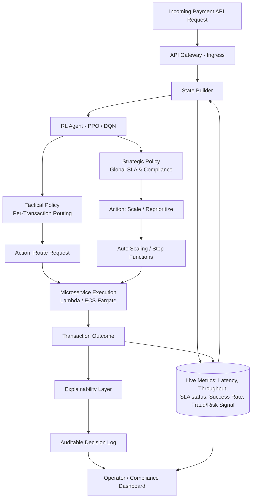

# Autonomous API Performance Optimization Framework for Digital Payment Gateways using Reinforcement Learning

An autonomous, closed-loop framework that uses deep reinforcement learning (PPO/DQN) to dynamically route, scale, and prioritize payment-gateway API traffic — jointly optimizing latency, throughput, SLA compliance, and transaction success rate, with a built-in explainability layer for financial-compliance auditability.

---

## Team Members

| Name | Registration No. |
|---|---|
| Aparajita Singh | 24BIT0447 |
| Riona Nath | 24BIT0319 |
| Anushka Sakhare | 24BIT0148 |

---

## Problem Statement

Digital payment gateways process large volumes of time-sensitive transactions, where any degradation in latency or reliability can adversely affect customer trust and company revenue. Current API performance improvement practices predominantly address these issues in isolation — static routing rules, rule-based load balancing, or single-objective models built for fraud detection, SLA prediction, or transaction-success routing. None of these jointly optimize latency, throughput, cost, and compliance within a single autonomous system.

Reinforcement learning research in this space is similarly narrow: it either targets payment routing success through bandit algorithms, or applies deep RL to generic cloud/API traffic without financial-domain constraints such as fraud-risk awareness and auditability. Existing RL approaches for API/payment traffic optimize narrow, single-domain objectives — e.g., transaction success rate alone (payment routing literature), or generic latency/throughput (cloud/IoT API-gateway literature) — and we are not aware of any framework that jointly optimizes latency, throughput, cost, and SLA compliance specifically for payment gateway APIs. We are also not aware of any autonomous system that closes the loop from detection to action while remaining auditable for financial compliance.

This project proposes and evaluates an **Autonomous API Performance Optimization Framework** that employs deep reinforcement learning to dynamically route, scale, and prioritize payment gateway API traffic based on a multi-objective reward — latency, throughput, SLA violations, and transaction success rate — paired with a lightweight explainability layer to ensure decision auditability.

---

## Objectives

1. **Develop an autonomous RL-based API performance optimization framework** for digital payment gateways that dynamically routes requests and scales backend microservices without manual intervention.
2. **Reduce end-to-end transaction latency and API response time** by training a deep reinforcement learning agent (PPO/DQN) on a multi-objective reward combining latency, throughput, and SLA compliance, benchmarked against static/rule-based routing baselines.
3. **Improve transaction success rate and SLA adherence** by incorporating success-rate and violation-penalty terms directly into the RL reward function, targeting measurable improvement over bandit-based and rule-based routing approaches.
4. **Integrate real-time cloud monitoring and autoscaling** using AWS services (API Gateway, CloudWatch, Lambda/ECS, Auto Scaling, Step Functions) to feed live system metrics into the RL agent's state space and execute its routing/scaling decisions.
5. **Ensure explainable and auditable decision-making** by implementing a lightweight explanation layer that justifies each routing/scaling action, supporting compliance and operator trust requirements specific to financial systems.
6. **Evaluate and visualize framework performance** through a dashboard tracking key metrics (latency, throughput, SLA violation rate, transaction success rate) against baseline methods on a reproducible open dataset (PaySim combined with open microservice traces).

---

## Proposed Architecture / Framework

The framework is a **closed-loop, hierarchical strategic–tactical RL system**: a global (strategic) policy manages cross-service SLA/compliance-level objectives, while a local (tactical) policy handles fine-grained, per-transaction routing decisions. Every action taken by the agent is paired with a lightweight explanation, so operators receive an auditable justification for what happened and why.

**Decision loop (detect → decide → act → explain):**
1. **Detect** — CloudWatch metrics and transaction outcomes continuously populate the RL agent's state space (latency, throughput, SLA-violation flags, transaction success rate, fraud-risk signal).
2. **Decide** — The hierarchical RL agent (strategic + tactical policy) selects a routing, scaling, or prioritization action based on a multi-objective reward function.
3. **Act** — The chosen action is executed via AWS-native primitives (API Gateway routing, Auto Scaling, Step Functions, Lambda/ECS-Fargate).
4. **Explain** — A lightweight explainability layer generates a human-readable justification for each decision, logged for compliance/audit review and surfaced on an operator dashboard.

---

## Technology Stack

| Layer | Technology |
|---|---|
| **RL Algorithms** | Proximal Policy Optimization (PPO), Deep Q-Network (DQN) |
| **ML/Training Platform** | Amazon SageMaker (training and inference) |
| **API Ingress** | Amazon API Gateway |
| **Microservice Execution** | AWS Lambda, Amazon ECS / Fargate |
| **Monitoring & Metrics (RL state source)** | Amazon CloudWatch |
| **Autoscaling & Action Execution** | AWS Auto Scaling, AWS Step Functions |
| **Low-Latency State Storage** | Amazon DynamoDB |
| **Logging & Model Artifacts** | Amazon S3 |
| **Dashboard / Visualization** | Web-based dashboard (e.g., Plotly Dash / Grafana / CloudWatch Dashboards) tracking latency, throughput, SLA-violation rate, and transaction success rate |
| **Languages & Libraries** | Python, PyTorch/TensorFlow, Stable-Baselines3 or Ray RLlib (RL implementation), Pandas/NumPy (data processing) |

---

## Dataset Details

### 1. PaySim (Transaction-Level Data)
| Field | Details |
|---|---|
| **Source** | Kaggle — https://www.kaggle.com/datasets/ealaxi/paysim1 |
| **Size** | ~470 MB (single CSV) |
| **Records** | ~6.3 million transactions |
| **Features** | 11 columns (step, type, amount, nameOrig, oldbalanceOrg, newbalanceOrig, nameDest, oldbalanceDest, newbalanceDest, isFraud, isFlaggedFraud) |
| **Data Type** | Structured tabular (numerical + categorical) |
| **License** | CC0 1.0 — Public Domain |
| **Purpose** | Simulates mobile money transactions (CASH-IN, CASH-OUT, DEBIT, PAYMENT, TRANSFER) to drive the RL reward's transaction-success and fraud-risk components |
| **Preprocessing** | Normalize numeric fields; encode `type`; hash/drop identifiers; handle severe class imbalance in `isFraud` (~0.13% positive); align hourly `step` index with microservice trace timestamps |

### 2. Alibaba Cluster Trace — Microservices v2021 (Infrastructure-Level Data)
| Field | Details |
|---|---|
| **Source** | Alibaba Cluster Trace Program — https://github.com/alibaba/clusterdata/tree/master/cluster-trace-microservices-v2021 |
| **Size** | Tens of GB across multiple trace tables |
| **Records** | Runtime data from ~20,000 microservices across 10,000+ bare-metal nodes over a 12-hour production window |
| **Features** | ~6–10 per table (node CPU/memory utilization, MS resource usage, call-graph response time, call type, invocation status, timestamps) |
| **Data Type** | Structured tabular + graph-structured call-dependency data |
| **License** | Free for academic/research use under Alibaba's Cluster Trace Program terms (citation requested); no formal open-data license attached |
| **Purpose** | Provides realistic microservice dependency graphs, response times, and load statistics to construct the RL environment's infrastructure state space |
| **Preprocessing** | Filter to a representative payment-gateway-like call chain; reconstruct call graphs; engineer P95/P99 latency and SLA-violation features; merge resource and call-graph tables; resample the 12-hour window to align with PaySim's 30-day horizon |

> **Integration note:** The two datasets are combined via a synthetic linkage layer that maps each PaySim transaction onto a simulated request traversing the Alibaba-trace-derived microservice call graph, so a single RL environment episode reflects both a financial outcome and an infrastructure performance outcome.

---

## Novelty Summary

Prior RL-for-API/payment literature solves narrow, single-domain problems in isolation: payment-routing RL optimizes success rate alone; generic API-gateway RL (IoT, ad-tech, cloud autoscaling) optimizes latency/throughput but ignores payment-domain constraints; and payment-specific ML work (fraud detection, SLA prediction) only predicts or monitors rather than autonomously acting. This project closes the loop — **detect → decide → act → explain** — specifically for the payment-gateway API layer, through:

- A **unified multi-objective reward** (latency, throughput, SLA compliance, cost, transaction success rate) in one policy.
- **Deep RL (PPO/DQN)** replacing heuristic/bandit-based production routing.
- A **hierarchical strategic–tactical architecture** repurposed for payment-domain state/action/reward definitions.
- **Deployment-ready AWS integration** closing the loop between RL decisions and real infrastructure.
- **Fraud-risk-aware routing** embedded directly into the state/reward rather than a disconnected pipeline.
- **Full automation** versus existing monitoring-only, alert-based systems.
- **Joint metric improvement** (success rate, P95 latency, SLA-violation rate) rather than single-metric optimization.
- **Reproducible evaluation** on an open dataset (PaySim + open microservice traces) rather than proprietary production-only data.
